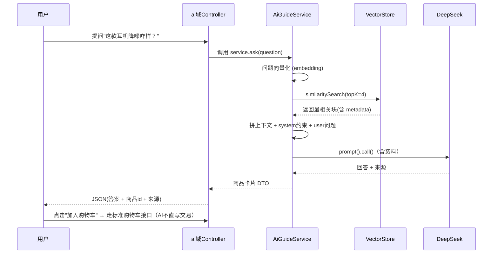

# Spring AI + RAG：零基础详解（以「AI 种草商城」V2 导购功能为导向）

> 目标读者：只会 Java 后端（MyBatis/Spring Boot）、**完全没学过 AI / 大模型 / 向量**，要给「AI 种草商城」做 V2 的「AI 智能导购」功能的你。
> 本文不是速查卡，而是把每个概念**从零讲透**：先讲"为什么"，再讲"是什么"，最后落到种草项目怎么用。
> 读完你能：① 给别人讲清 RAG 的每一步在干什么；② 能照着代码把 V2 导购功能搭出来。

---

## 0. 先对齐：技术栈版本（重要，别用错）

种草项目设计文档用的 **Spring Boot 3 + Java 17**，因此必须配套 **Spring AI 1.1.x**，**不能用 RAG 旧笔记里的 Spring AI 2.0.0/Boot 4.1**。

版本对应关系（2026-08 已核实）：

| Spring AI 版本 | 最低/配套 Spring Boot | 适用 |
|---|---|---|
| **1.1.x** | **3.5.x** | **本项目（Boot 3）用这个** |
| 2.0.0 | 4.0 / 4.1 | 新项目、Boot 4 用这个 |

也就是说：**版本跟着 Spring Boot 走**。你项目定了 Boot 3，Spring AI 就锁 1.1.x。
（[版本对应关系来源](https://github.com/spring-projects/spring-ai) / [Spring AI 2.0 GA 发布说明](https://spring.io/blog/2026/06/12/spring-ai-2-0-0-GA-available-now/)）

> 提醒：同一个 `org.springframework.ai` 坐标，用错版本号会拉来一串对不上的传递依赖。
> 用 Boot 3 + Spring AI 1.1.x，是种植项目 V1 就能验证的基线，先跑通再往后走。

本项目 V2 导购相关的技术选型（对齐设计文档）：
- 对话模型：DeepSeek（OpenAI 兼容协议）
- 向量存储：**V2 先用 MySQL 向量列或 Redis Stack**（对应设计文档"向量检索演进"，数据量大再到 Milvus）
- 本文以 **Chat + Embedding + RAG 检索链路**为主线，向量存储用 **Spring AI 的 `VectorStore` 抽象**，底层用 MySQL 或 Redis，二者只差 starter 和几条配置。

---

# 第一单元：大模型是什么（先有正确心智模型）

> 这一单元没有任何代码，但它是整个 RAG 的地基。跳过它，后面的 API 你只会死记、不会理解。

## 1.1 LLM：一个"读过海量文本、擅长接着往下写"的实习生

LLM（Large Language Model，大语言模型）不是一个"什么都知道的百科全书"。准确地说，它是一个**学出来的"文字接龙器"**：

- 它读过的文本量极其巨大（互联网级别的语料）。
- 训练的目标很简单：给定前面一段文字，猜测"最可能的下一个字/下一段"是什么。
- 因为语料足够多，它把很多人类知识和语言规律都"压"进了自己的参数里，所以表现得像是能理解、能推理——但它本质是在做**高概率的续写**。

对 Java 后端而言，请建立这个心智模型：

> **LLM = 一个读过无数书、反应快、但会"一本正经胡说八道"的实习生。你的职责是给它清楚的指令、足够的上下文、并审核它的输出。**

由此引出三个必须懂的概念：

### Token（词元）：模型读写的"最小文字单位"
模型不是按"字"读的，而是按 **token** 读的。一个 token 大致是"英文半个词、中文半个到几个字"。API 按 token 计费，模型也有"一次性最多能处理多少 token"的硬上限。

- 一句话会被切成一串 token，例如 `你好，世界` 可能被切成 4~6 个 token。
- 你的成本 ≈ 输入 token + 输出 token。
- 这决定了后面 RAG 里"省 token"为何重要：塞给模型的内容越少，越快、越便宜、越不容易超限。

野外生存直觉：
- 当你觉得"这段字很多"时，大概率 token 也不少。
- **上下文窗口（context window）**：模型一次能"同时看到"的 token 上限，可以想象成实习生同时摊在桌上能看的资料量。装不下就装不下，要么截断要么丢。

### Prompt：你发给模型的所有输入（指令 + 资料 + 示例）
模型输出质量，一半以上取决于 Prompt 质量。"不会提问，就给不出好答案"，这在 AI 里被放大到极致。
你后面会反复看到这句话：**RAG 的本质，就是在把"资料"精心装进 Prompt。**

### Embedding（向量化）：把"文字意思"翻译成"坐标"
这是理解全文的第二块地基，单独拉一节讲。

## 1.2 Embedding：把文字变成一串"能比大小"的数字

**问题**：计算机要比较"一句话和另一句话像不像"，但文字本身没法直接比大小。

**Embedding 的答案**：用一个训练好的模型，把每段文字映射成一串固定长度的数字（称为**向量**），做到：

> **语义相近的文字 → 向量在空间里也靠得很近。**

想象给每句话发一个"语义 GPS 坐标"：
- `我今天心情很好` 和 `我好开心啊` → 坐标挨得很近（意思相近）
- `我今天心情很好` 和 `这个程序报错了` → 坐标离得很远（意思无关）

关键点（面试常问、理解核心）：

- **维度（dimensions）**：一个向量的数字个数。例如 1024 维，就是 1024 个数字代表这句话。
- **`EmbeddingModel`**：做"文字→向量"转换的那个模型，例如 OpenAI 的 embedding 模型、BGE 系列。
- **同一段文字用不同 embedding 模型，会得到不同维度和不同分布的向量** —— 所以"入库用什么模型，查询也得用什么模型"，二者维度还必须一致（后面专讲这个坑）。

### 相似度：余弦相似度
两个向量是否"方向接近"，常用**余弦相似度**衡量：
- 结果在 `[-1, 1]`，越接近 `1` 表示方向越一致、越相似。
- 越接近 `0` 或为负，表示差异越大。

**威力所在**：向量比的是"语义"而不是"关键词"。用户问"这款耳机降噪咋样"，文档里没出现"降噪"，但语义相关，就能被检索到。**这就是 RAG 比 `LIKE '%关键词%'` 强一个量级的原因。**（可靠性置信度：高，这是 RAG 的核心价值，业界普遍认可。）

## 1.3 小结：第一单元的心智模型

| 概念 | 一句话理解 |
|---|---|
| LLM | 会续写的实习生，会胡说（幻觉），需要你约束 |
| Token | 计费和容量单位，省 token = 省钱省时 |
| 上下文窗口 | 一次能装下的 token 上限 |
| Embedding | 用向量坐标表示"语义"，意思近→坐标近 |
| 余弦相似度 | 衡量两个向量像不像 |
| Prompt | 你给模型的一切输入，质量决定输出 |

> 到这里，你已经超过了"完全零基础"。下面进入 Spring AI 和 RAG。

---

# 第二单元：Spring AI 是什么、为什么用它

## 2.1 你会有的第一个疑问：我直接调 HTTP 不行吗？

行。调用大模型本质就是一个 HTTP POST（发一段文本，收一段文本）。
但用 Spring AI 的意义在于：

1. **统一抽象**：无论 DeepSeek / OpenAI / 阿里百炼 / Ollama，都是"OpenAI 兼容协议"，Spring AI 用一个 `ChatClient` 全搞定，换厂商只改配置，不改业务代码。
2. **帮你封装了一批重活**：流式输出、结构化输出（把返回解析成 Java 对象）、RAG 的向量存储/切分/检索，都有现成组件。
3. **跟 Spring 生态无缝**：自动配置、Bean 注入、与 MyBatis/Redis 共存。

> 直白讲：你当然可以 `RestTemplate.postForObject("https://api.deepseek.com/chat/completions", ...)` 硬调，
> 但那就得自己处理鉴权、JSON、流式、超时重试、多厂商切换…… Spring AI 把这一层全抽象好了。
> **对 Java 后端求职者，这就是"工程化落地的加分项"。**

## 2.2 Spring AI 核心组件一览（记住这张图）

Spring AI 帮你把"AI 应用"拆成了几个清晰的部件：

```
你的业务代码
   │
   ├── ChatClient          ← 对话入口，封装"发 prompt → 收回答"
   ├── EmbeddingModel      ← "文字 → 向量"的转换器
   ├── VectorStore         ← 向量库抽象（存向量 + 相似检索）
   ├── DocumentReader      ← 读文档（txt/pdf/docx/网页...）
   ├── TextSplitter        ← 把长文档切成小块
   └── QueryTransformer（进阶）← 改写/改写问题再检索
```

> 这一节先混个脸熟，每一件我们都会在后面逐一展开并用代码演示。
> **RAG 流程 = 上面这些组件的组合。**

## 2.3 在种植项目里，Spring AI 放在哪一层

回到设计文档：项目分 `user / content / goods / order / ai` 域，AI 在 `ai` 域。

- `ai/` 可能是独立服务（V4 拆微服务后是 `ai-service`），V1/V2 阶段则是单体里的一个包。
- **AI 域不直接写交易数据**：导购返回推荐，用户点"加入购物车"走标准购物车接口。AI 只做"判断 + 生成文案 + 检索"，动手改数据必须通过受控接口。这条是设计文档的硬约束，也是面试亮点。

---

# 第三单元：Spring AI 对话入门（Chat）

> 动手前的心智：Chat = "给模型一句话，拿回一段回答"。这是最基础、也是后面所有 AI 功能的起点。

## 3.1 引入依赖（Boot 3 + Spring AI 1.1.x）

种植项目用 Maven。在 `pom.xml` 加两个 starter：

```xml
<!-- 通过 Spring AI BOM 统一版本（推荐，防版本对不上） -->
<dependencyManagement>
    <dependencies>
        <dependency>
            <groupId>org.springframework.ai</groupId>
            <artifactId>spring-ai-bom</artifactId>
            <version>1.1.5</version>   <!-- 1.1.x 任一具体版 -->
            <type>pom</type>
            <scope>import</scope>
        </dependency>
    </dependencies>
</dependencyManagement>

<dependencies>
    <!-- 对话 + Embedding（OpenAI 兼容协议，DeepSeek 用同一个 starter） -->
    <dependency>
        <groupId>org.springframework.ai</groupId>
        <artifactId>spring-ai-starter-model-openai</artifactId>
    </dependency>
</dependencies>
```

> DeepSeek 走 OpenAI 兼容协议，所以用 `spring-ai-starter-model-openai`，只需把 `base-url` 指到 DeepSeek 即可，不用单独的 DeepSeek starter。
> （真实写法来源：[Spring AI OpenAI Chat 参考](https://docs.spring.io/spring-ai/reference/2.0/api/chat/openai-chat.html)）

## 3.2 配置：连接 DeepSeek

`application.yml`：

```yaml
spring:
  ai:
    openai:
      base-url: ${AI_CHAT_BASE_URL:https://api.deepseek.com}
      api-key: ${AI_CHAT_API_KEY:}          # 你的 DeepSeek Key，别写死在代码里
      chat:
        options:
          model: ${AI_CHAT_MODEL:deepseek-chat}
```

> 环境变量方式（对齐种植项目的 `.env` 风格），Key 不落库、不提交 git。

### 流式输出（可选，但种植项目 V1 就提到"流式"）
普通接口是"等完整回答一次性返回"，体验像转圈。
流式是"边生成边吐"，用户看着字一个个蹦出来，体验好。Spring AI 用响应式 Flux：

```java
Flux<String> flux = chatClient.prompt()
        .user("介绍一下这款耳机")
        .stream()
        .content();
```

> V1 阶段用同步 `.call().content()` 先跑通即可，流式是优化项，别一开始就卡在响应式上。

## 3.3 ChatClient：把你调模型的代码收敛成一个 Bean

**为什么需要 `ChatClient`？** 如果每次调用都自己拼 HTTP、解析 JSON，业务代码会被"如何调模型"污染。
`ChatClient` 就像给 HTTP 穿衣服：你只关心"我发什么、拿回什么"。

典型写法（对齐设计文档的 `config/AiClientConfig` 思路）：

```java
@Configuration
public class AiClientConfig {
    @Bean
    ChatClient chatClient(ChatClient.Builder builder) {
        return builder.build();
    }
}
```

然后业务 Service 里注入它：

```java
@Service
public class AiGuideService {
    private final ChatClient chatClient;

    public AiGuideService(ChatClient chatClient) {
        this.chatClient = chatClient;
    }

    public String chat(String question) {
        String answer = chatClient.prompt()   // 开始组装一次调用
                .user(question)               // 放用户消息（输入）
                .call()                       // 真正发请求（同步，阻塞拿结果）
                .content();                   // 取纯文本回答
        return answer;
    }
}
```

`prompt() → .user(...) → .call() → .content()`，四个动作翻译成人话：
1. `prompt()`："开一条新的对话组装流"
2. `.user(question)`："把用户的话放进输入"
3. `.call()`："把请求发出去，等模型返回"（同步、阻塞）
4. `.content()`："从丰富的结果对象里取出纯文本回答"

> 置信度：`prompt().user().call().content()` 是当前 Spring AI 的标准写法
> （[ChatClient 官方文档](https://docs.spring.io/spring-ai/reference/api/chatclient.html)）。1.1 系列就是这套。

## 3.4 Prompt 的内部：不止"用户的一句话"

很多初学者以为 Prompt 只有"用户那句话"。不对。**一次模型调用，通常由多段消息组成**：

| 消息角色 | 作用 | 何时用 |
|---|---|---|
| **system** | 设定角色、规则、行为边界，优先级最高 | 给模型立规矩，比如"只回答跟本店商品有关的问题" |
| **user** | 用户这次的问题 | 每次必有 |
| **assistant** | 模型上一次的回答；也用于 few-shot 给示例 | 多轮对话、给示例时用 |

```java
String answer = chatClient.prompt()
        .system("你是电商导购，只回答本商城商品相关问题；不知道就说不知道。")
        .user("这款耳机支持蓝牙 5.3 吗？")
        .call()
        .content();
```

> 这个"system + user"的结构，是第三单元最重要的一张图。
> 记住：**system 是约束模型行为的那条"紧箍咒"**。后面 RAG 的核心招数之一，就是往 system 里塞 "资料"+ 立规矩。

## 3.5 给你的种植项目第一步验证（V1 验收项）

在 `ai` 域建一个最朴素的 `AiGuideController` + `AiGuideService`，先跑通基础对话：

```java
@RestController
@RequestMapping("/api/ai")
public class AiGuideController {
    private final AiGuideService aiGuideService;
    public AiGuideController(AiGuideService aiGuideService) {
        this.aiGuideService = aiGuideService;
    }

    @PostMapping("/chat")
    public Map<String, String> chat(@RequestBody Map<String, String> req) {
        return Map.of("answer", aiGuideService.chat(req.getOrDefault("message", "")));
    }
}
```

用 curl 验证（Windows 用 `curl.exe` 避免 PowerShell 别名）：

```bash
curl.exe -X POST http://localhost:8080/api/ai/chat \
  -H "Content-Type: application/json" \
  -d "{\"message\":\"介绍下这款耳机\"}"
```

> 这一步走通，你就完成了"Spring AI 接入"这一半。
> 接下来所有进阶（RAG/审核/客服/分析）都是在 `ChatClient` 这个入口上加料。

---

# 第四单元：RAG —— 为什么、是什么（本笔记的核心）

## 4.1 先逼自己回答一个"为什么"

只靠第三单元的 `ChatClient`，你的导购能干活吗？能，但会很烂，原因有三个：

1. **模型不懂你的商品**。DeepSeek 学过的是互联网通用知识，它不是你的货架。问"我们商城那款降噪耳机的防水等级"，它只能瞎编。
2. **上下文窗口装不下你的全部商品文档**。你可能上百份说明书，全塞进 prompt 里又超限又贵。
3. **幻觉**。模型不知道就不会编。它不知道你的商品时，会一本正经地给出一个根本不存在的答案——这在线下销售里是灾难。

> 那怎么办？——微调？要训练数据、GPU、成本高、周期长。
> 对"知识更新快、要引用依据、要低成本"的需求，业界选 **RAG**。

**一句话定义：**
> **RAG（Retrieval-Augmented Generation，检索增强生成）= 先生成回答"之前"，先从自己的库里找出最相关的资料，把资料喂给大模型，让它"有依据地"回答。**

用图书馆类比：
- 你的知识库 = 图书馆里的书架。
- 用户提问 = 用户来问问题。
- **检索** = 图书管理员先在书架里找到最相关的几页书。
- **生成** = 把这几页书铺在模型面前，让模型照着写答案。

关键区别：**模型不再凭空回答，而是"看着资料回答"。** 答得有依据，还能指出来源。

## 4.2 RAG 的完整流程（一次记住这张图）

RAG 分**两条线**，一条管"入库"（一次性准备），一条管"问答"（每次请求走）：

```
① 入库线（准备阶段，一次做完建索引）：
   文档加载 → 分块 → 向量化(embedding) → 存入向量库

② 问答线（每次用户提问都走一遍）：
   用户问题 → 向量化(embedding) → 相似检索(topK) → 拼上下文 → 交给LLM生成
```

**对比整个 RAG demo 的旧笔记，你会发现核心其实就这条线。**
这条线的每一步，都是下面第五、六单元的章节名。

## 4.3 为什么 RAG 里的每一步都"必须有"（理解而非背诵）

| 步骤 | 为什么必须有 | 去掉会怎样 |
|---|---|---|
| **文档加载** | 知识总得有来源，从 PDF/Word/MD 里提出文本 | 没有知识可导 |
| **分块** | 文档太长塞不进上下文；整篇入库检索不精确 | 上下文超限 / 检索出一大片噪音 |
| **向量化** | 计算机要按"语义"找相关，必须转成坐标 | 无法做语义检索 |
| **存向量库** | 存起来并支持"找最近邻"的高效检索 | 每次都全量比对，太慢 |
| **问题向量化** | 用户问题也要转成同一坐标系才能比 | 无法和库里向量比较 |
| **相似检索 topK** | 从库里挑出最相关的 K 段 | LLM 没依据，只能瞎编 |
| **拼上下文** | 把检索到的资料跟问题一起给模型 | 模型看不到资料 |
| **LLM 生成** | 让模型"据资料作答" | 一切白搭 |

> **记忆锚点：入库线是"把图书馆整理好"，问答线是"每次来借书"。**

---

# 第五单元：入库线 —— 文档怎么进去（四个动作详解）

> 这一单元讲"怎么把商品说明书、评测文档变成可检索的向量"。对应种植项目 V2 的"上传文档 → 导购能懂"。

## 5.1 动作一：文档加载（DocumentReader）

**目的**：把一份物理文件（.md/.txt/.pdf/.docx）里的文字读出来，变成程序里的"文档对象"。

Spring AI 提供一组 `DocumentReader` 实现，按来源分类：
- **通用文件**：Spring AI 的文本/document reader（支持读文件、URL 等）
- Word/Excel/PDF 等：设计文档说 V2 用 **Apache POI / PDFBox** 自己解析——这也完全可行，因为 Spring AI 的含义只是"你拿到 `Document` 对象"。

核心概念：**`Document` = 一个"文字块 + 元数据"的单位**。

```java
import org.springframework.ai.document.Document;
import org.springframework.core.io.Resource;

// 读一个文件资源，得到若干 Document（底层可能已按段落拆成多个）
Resource resource = resourceLoader.getResource("classpath:/knowledge/耳机说明书.md");
List<Document> docs = /* documentReader 读出来的结果 */;
```

> 种植项目里，运营上传商品知识文档 → 后端用 reader（或 POI/PDFBox）提文本 → 得到第一批 `Document`。

### 元数据（metadata）：给每个块"贴标签"
`Document` 自带一个 `metadata`（键值对），用来记"这块是哪来的、属于哪个商品"。这非常重要：
- 导购回答时好给**来源引用**（"来自《XX 耳机说明书》"）。
- 删除时好按文件名/商品 ID 批量删。

```java
Document doc = new Document(textContent);
doc.getMetadata().put("productId", "1001");
doc.getMetadata().put("filename", "XBOX耳机说明书.md");
```

## 5.2 动作二：分块（TextSplitter）

**问题**：一份说明书可能几千字，整段当一条记录入库，检索时会"一竿子打一船"，关联度被稀释。
**解法**：把长文档切成**若干小块**，每个小块单独向量化、单独入库。

分块器（`TextSplitter`）其实就是"在适当位置切句子/段落"的工具。

### 用 TokenTextSplitter（按 token 数切"大约多长一块"）

一种常见实现是 `TokenTextSplitter`，构造参数含义（[参考](https://blog.csdn.net/wayle123/article/details/159245718)）：

```java
TextSplitter splitter = new TokenTextSplitter(
        500,   // chunkSize:     目标每块约 500 token
        50,    // overlap:       相邻块重叠 50 token，避免语义被硬生生切断
        5,     // chunkSizeLimit...（这里具体是头/尾保留的 token，理解成"边界保护"即可）
        10000, // （尾保留 token）
        true   // keepSeparator: 是否保留分隔符
);
```

> 关于"overlap（重叠）"：块和块之间故意留一点重叠，防止"一句话正好被切成两半，两边都不完整"。这是提升检索精度的重要细节，面试常问。

### 什么时候切、怎么切才合理（经验，非硬规则）
| 想清楚的问题 | 直觉答案 |
|---|---|
| 块多大合适？ | 数百 token 左右。太小碎、太大糙 |
| 中文怎么切？ | 按句号、段落切，别把一句话的意思劈开 |
| 需要 overlap 吗? | 要，10%~20% 为宜 |
| 复杂文档怎么办？ | 进阶用"父子块"（子块检索、父块补上下文），本项目 V1-V2 不必做 |

## 5.3 动作三：向量化（EmbeddingModel）

分块得到一批 `Document` 后，要对**每块的正文**做 embedding：

```java
import org.springframework.ai.embedding.EmbeddingModel;

List<float[]> vectors = embeddingModel.embed(docsText); // 每个文本 → 一个 float[] 向量
```

要点（务必吃透，这是坑的重灾区）：

1. **入库与查询必须用同一个 embedding 模型。** 用 A 模型入库、B 模型查询，两个坐标系对不上，永远检索不到。
2. **向量维度（dimensions）必须与存储端配置一致。** 例如 embedding 模型输出 1024 维，向量库/表就必须按 1024 维建，否则报"维度不一致"。
3. 换模型 = 需要**重新向量化入库**（旧向量坐标系已作废）。这正是 RAG 旧笔记里"换 embedding 模型踩坑"的那条经验。

## 5.4 动作四：存入向量库（VectorStore）

上一单元说了 Embedding 把文字变坐标，现在要**存起来并支持"找最近的"**。

**这里用到 Spring AI 的 `VectorStore` 抽象** —— 这才是你不需要天天写 SQL 的地方。

### 种植项目 V2 怎么选存储（对齐设计文档"向量检索演进"）

| 阶段 | 存储 | 理由 |
|---|---|---|
| V2（起步） | **MySQL 向量列，或 Redis Stack** | 万级数据量够用，不引入新组件（Redis 后面 V3 本来就要上） |
| V5（数据量大后） | Milvus | 专用向量库，只改检索适配层，业务代码不变（抽象的好处） |

**为什么设计文档这么走？** 因为 Spring AI 把存储抽象成 `VectorStore` 接口，
底层是 MySQL 还是 Redis 还是 Milvus，业务代码基本**不用改**——只是换 starter + 配置。这就是"设计上预留接口"的价值。

### 以 Redis VectorStore 为例（了解即可，MySQL 思路同理）

Redis 做向量检索需要 **Redis Stack**（内置了 RediSearch/RedisJSON 支持向量索引）。
（[参考](https://javatechonline.com/ai-document-search-with-spring-boot-ai-redis/)）

```bash
docker run -d --name redis-stack -p 6379:6379 redis/redis-stack-server:latest
```

```yaml
spring:
  data:
    redis:
      url: redis://localhost:6379
```

```java
import org.springframework.ai.vectorstore.VectorStore;
import org.springframework.ai.vectorstore.SearchRequest;

// 把上面向量化好的 Document（含向量+metadata）写入向量库
vectorStore.write(docsWithVectors);
```

> 不用纠结 Redis 还是 MySQL 的实现细节——**你现在只需要懂 `vectorStore.write(...)` 把入库线走完**。
> 真正实现时用一个即可（推荐 V2 直接用项目中已有的 MySQL 或 Redis，少起一个组件）。

## 5.5 小结：入库线四动作

```
文档加载 reader → 分块 splitter → 向量化 embedding → 存库 vectorStore.write
```
对应种植项目 V2 的**接口链路**：上传商品文档 → 解析 → 分块 → 向量化 → 入库。
入库线的产出，就是那个"整理好的知识库"——第四单元的图书馆。

---

# 第六单元：问答线 —— 用户提问后发生了什么（详解）

> 这是 RAG 每次请求都会走的热路径，也是你面试要讲的主链路。

## 6.1 问答线四步（对着代码看）

```
用户问题 → 问题向量化 → 相似检索(topK) → 拼上下文 → LLM生成答案
```

### 第一步：问题向量化
用户的话也要用**同一个** embedding 模型转成向量，才能和库里的向量比。

### 第二步：相似检索（VectorStore.similaritySearch）
用 `topK` 指定"取回最相关的几块"：

```java
VectorStore vectorStore; // 注入

List<Document> hits = vectorStore.similaritySearch(
        SearchRequest.builder()
                .query("这款耳机降噪效果怎么样？")   // 用户问题
                .topK(4)                            // 取回最相似的 4 块
                .build());
```

### 第三步：拼上下文（这就是 RAG 的"精妙"所在）
把检索到的几块**整理成一段文字**，连同用户问题、系统的约束规则，一起装进 Prompt。

```java
String context = hits.stream()
        .map(d -> "- 【来源：" + d.getMetadata().get("filename") +
                  "】" + d.getText())
        .collect(Collectors.joining("\n"));

String answer = chatClient.prompt()
        .system("你是严谨的商城导购。只根据下面资料回答；资料里没答案就回答'根据现有资料无法回答'，不要编造。\n\n资料：\n" + context)
        .user("这款耳机降噪效果怎么样？")
        .call()
        .content();
```

注意这行 system："只根据资料回答 + 找不到就说不知道" —— **这就是 RAG 缓解幻觉的核心约束。**

### 第四步：LLM 生成
模型基于给定的 `context` 作答，而不是凭本事瞎说。
（信息追加：Spring AI 官网有 structured-output，可让返回反序列化成 DTO，见 [Structured Output](https://docs.spring.io/spring-ai/reference/2.0-SNAPSHOT/api/structured-output-converter.html)。V2 可把答案 + 来源做成结构化返回。）

## 6.2 topK 和相似度阈值（本单元最重要的调参直觉）

| 参数 | 是什么 | 调大/调小的影响 |
|---|---|---|
| **topK** | 一次取回几块 | **调小**：漏答案；**调大**：多噪声、撑爆上下文、贵 |
| **similarityThreshold** | 相似度下线，低于它的拒绝 | 提**高**：滤噪，但可能滤掉正确答案（空召回）；保持 0 = 不过滤 |

调参顺序（面试必会讲）：
> **先保证"能检索到"（topK 调大、阈值先放开），再逐步收紧看回答质量。**

## 6.3 检索不到/答不对，怎么排查（种植项目自检清单）

1. 入库时 `chunks`（切出的块数）> 0 吗？为 0 说明分块没成功或没入库。
2. 入库和查询用的是**同一个 embedding 模型、维度一致**吗？（第五单元最大的坑）
3. 分块是否切得太碎，把关键信息拦断在过了？（看第 5.2 overlap）
4. `topK` 太小、`similarityThreshold` 太高？
5. 用户问题太口语/太笼统？可加"问题改写"再检索（进阶）。

---

# 第七单元：提示词工程 (Prompt Engineering) —— 让模型"听话"

> 你已经看到 system + 资料 + 约束的威力了。这一单元系统化讲"怎么让模型表现更好"。
> 面试这里能加分，因为它是"你会不会真的用"的分水岭。

## 7.1 system / user / assistant 回忆

| 角色 | 作用 | 优先级 |
|---|---|---|
| system | 设定角色、规则、知识边界 | 最高（模型最听话的部分） |
| user | 用户的问题 | — |
| assistant | 模型历史回复 / few-shot 示例 | — |

**给种植项目导购的实操 system 模板：**

```java
String system = """
        你是一个电商导购助手，只服务「AI 种草商城」。
        规则：
        1. 只根据 "资料" 中提供的内容回答；
        2. 资料里没有的，回答“根据现有资料无法回答”，绝不编造；
        3. 保持礼貌、简洁、口语化；
        资料：
        %s
        """.formatted(context);
```

## 7.2 few-shot：给示例，让模型照猫画虎

有时抽象指令不管用，给"输入→输出"示例最有效（尤其要固定格式时）：

```java
chatClient.prompt()
        .system("""
                用户问：什么是 topK？
                答：检索时取回的最相似片段数量，默认 4。

                用户问：什么是 similarityThreshold？
                答：相似度下限，设为 0 表示不过滤。
                """)
        .user("什么是 HNSW？")
        .call()
        .content();
```

## 7.3 输出格式控制（三招）

1. **文本指令法**：Prompt 里写 "只输出 JSON"。简单但不稳。
2. **结构化输出法**：Spring AI 的 `.call().entity(YourDTO.class)`，把返回直接反序列化成 Java 对象，最稳。
   （[参考](https://docs.spring.io/spring-ai/reference/2.0-SNAPSHOT/api/structured-output-converter.html)）
3. **参数法**：调低 temperature（采样随机度），输出更稳定。temperature 越低越保守、越接近"指定答案"。

> 种植项目导购返回"商品卡片 + 来源"，非常适合配合结构化输出：让模型返回一个 DTO，你直接在代码里拿字段，不用解析字符串。这是比"给纯文本"更进阶的一步，面试可讲。

---

# 第八单元：种植项目 V2「AI 智能导购」落地蓝图

> 把上面所有单元收拢成一份"照着做"的清单。对齐设计文档 4.4 的"AI 智能导购"。

## 8.1 需求回顾（设计文档原文要点）
用户自然语言提问 → RAG 检索商品知识库（说明书/评测笔记/规格）→ 大模型生成推荐理由 → 返回商品卡片 → 一键加购物车。

## 8.2 端到端时序（画出即懂）



## 8.3 需要落库的表（对齐设计文档 5.4 / 5.3）
- `t_knowledge_doc`（知识文档）/ `t_knowledge_chunk`（切好的块 + 向量）
- 导购会话与消息：`t_conversation` / `t_message`
- 成本统计：`t_rag_usage`（你上 AI 就知道有多能烧 token，记一笔很加分）

## 8.4 Service 骨架（给出可改的雏形）

```java
@Service
public class AiGuideService {
    private final ChatClient chatClient;
    private final EmbeddingModel embeddingModel;
    private final VectorStore vectorStore;

    // 构造器注入，省略

    /**
     * 导购回答：RAG 检索 + 生成
     */
    public GuideResult ask(String question, int topK) {
        // 1. 检索：问题会被内部转成向量，再找 topK 近邻
        List<Document> hits = vectorStore.similaritySearch(
                SearchRequest.builder().query(question).topK(topK).build());

        // 2. 拼上下文，带上来源
        String context = hits.stream()
                .map(d -> "- 【" + d.getMetadata().get("filename") + "】" + d.getText())
                .collect(Collectors.joining("\n"));

        // 3. 生成（system 约束 + 资料 + user 问题）
        String answer = chatClient.prompt()
                .system(buildSystemPrompt(context))
                .user(question)
                .call()
                .content();

        // 4. 返回答案 + 商品/来源信息（可再抽成结构化 DTO）
        return new GuideResult(answer, extractProductIds(hits));
    }

    private String buildSystemPrompt(String context) {
        return """
                你是电商导购。只根据资料回答；资料没答案就说"根据现有资料无法回答"，不编造。
                资料：
                %s
                """.formatted(context);
    }
}
```

## 8.5 验收测试（V2 导购功能完成的定义）
- 上传一份商品文档，`chunks > 0`。
- 问"这款耳机支持蓝牙 5.3 吗"，能引用文档回答，且指出来源文件。
- 问一个文档里没有的问题，能说"根据现有资料无法回答"（而不是编造）。
- 用户能通过返回的商品卡片加购物车（走标准接口）。

---

# 第九单元：面试怎么讲（把你学到的组织成话术）

## 9.1 一版"60 秒讲清 RAG"
> "RAG 就是给大模型加上一个可检索的外部知识库。分两步：入库线把文档加载、分块、向量化后存进向量库；问答线把用户问题也向量化，从库里按语义检索出最相关的 topK 片段，拼进 Prompt 作为依据，再让模型据资料回答。这样模型不会凭空编造，还能给出来源。"

## 9.2 高频追问预案

| 面试官问 | 你答（用本文知识） |
|---|---|
| 为什么用 RAG 不微调？ | 知识更新快（换文档重灌）、成本低、可溯源、能缓解幻觉；微调适合改风格/能力，要训练数据和 GPU |
| embedding 是什么/维度不一致会怎样？ | 把文字变坐标，语义近则坐标近；入库和查询必须同一模型同维度，否则检索失灵 |
| 为什么要分块？ | 塞不进上下文、整篇检索精度差；overlap 防语义被切碎 |
| topK 是多少 / 怎么调？ | 默认几个；先放大保召回、再收阈值，必要时 rerank |
| 遇到过的真坑？ | 换 embedding 模型后老数据坐标系作废要重灌；检索为空先查 chunks 和维度 |
| 你的向量库为什么这样选？ | V2 用现有 MySQL/Redis，量大了再迁 Milvus 只改适配层（讲"预留接口"） |
| AI 怎么保证安全? | 遵循"AI 不直写交易数据"：导购只检索和生成文案，加购物车走标准接口 |

## 9.3 简历里怎么落
（放在种草项目 AI 域部分）
- 用 Spring AI（Boot 3 + 1.1.x + DeepSeek）接入对话与 Embedding；
- 用 VectorStore 抽象实现商品文档入库与语义检索；
- 配置 topK/阈值调优，拼接带来源上下文并约束"只据资料回答"，缓解幻觉。

---

# 附：踩坑速查（照着排查，能救你一天）

| 症状 | 最大嫌疑 |
|---|---|
| 401 认证失败 | api-key 没配 / 配错（DeepSeek Key） |
| 检索总是空 | ① 入库与查询不是同一模型/维度 ② topK 太小 ③ 阈值太高 ④ chunks=0 没入库 |
| 维度不一致报错 | 向量列维度 vs embedding 输出维度没对齐；换模型后没重灌 |
| 回答信任胡编 | system 没写"只据资料回答"；检索到的块太碎/太偏 |
| assistant 上下文超限 | topK 太大、块太长、多轮累加不清理 |
| 连不上数据库 | V2 用 MySQL/Redis 要起好；端口/账号/URL 对不上 |

---

## 参考资料
- Spring AI 官方文档：[ChatClient](https://docs.spring.io/spring-ai/reference/api/chatclient.html)、[Structured Output](https://docs.spring.io/spring-ai/reference/2.0-SNAPSHOT/api/structured-output-converter.html)
- Redis VectorStore：[RedisVectorStore](https://docs.spring.io/spring-ai/docs/current/api/org/springframework/ai/vectorstore/redis/RedisVectorStore.html)、[用 Redis 做 AI 文档检索](https://javatechonline.com/ai-document-search-with-spring-boot-ai-redis/)
- 版本对应：[Spring AI 主仓库](https://github.com/spring-projects/spring-ai)、[Spring AI 2.0 GA](https://spring.io/blog/2026/06/12/spring-ai-2-0-0-GA-available-now/)
- 老版 (Boot 3 / Spring AI 1.x) 中文参考：[Spring AI 参考（springjava.cn 镜像）](https://docs.springjava.cn/spring-ai/reference/api/chatclient.html)